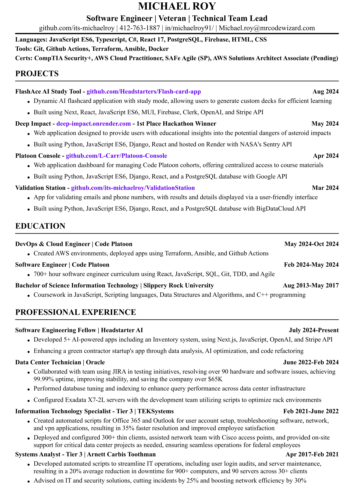

# <h1>ResumeGenerator</h1>

*A C# PDF Resume Generator*

`ResumeGenerator` is a **C# console application** that creates a professional, well-formatted PDF resume. Built using **.NET 8** and the **QuestPDF library**, it allows users to programmatically define their resume content and export it as a clean, structured document.

---

## 📌 **Table of Contents**
- [Project Description](#project-description)
- [Features](#features)
- [Installation & Running](#installation-&-running)
- [Usage](#usage)
- [Screenshots](#screenshots)
- [Credits](#credits)
- [License](#license)

---

## <h2 id="project-description">📖 Project Description</h2>
### 🎯 **Motivation**
Creating a polished resume can be time-consuming, especially when formatting it manually in tools like Adobe, Word or Google Docs. `ResumeGenerator` was developed to **automate this process**, providing a **programmatic, repeatable way** to generate a professional resume in PDF format.

### 🎯 **Purpose**
✅ Generate a **structured** resume with minimal effort  
✅ Ensure **consistent formatting** across sections  
✅ Export to **PDF** for easy sharing and printing  
✅ Allow **customization** through code  

### 🎯 **Problem Solved**
Manual resume formatting is prone to errors and inconsistencies.  
`ResumeGenerator` **solves this by**:  
✔ Centralizing resume content in a single C# file  
✔ Automating layout with **predefined styles**  
✔ Producing a **print-ready PDF** instantly  

### 🎯 **Lessons Learned**
Building `ResumeGenerator` offered insights into:  
✔ Working with **PDF generation** in C# using QuestPDF  
✔ Structuring **complex layouts** programmatically  
✔ Managing **dependencies** via NuGet  
✔ Handling **exception management** and file I/O in .NET  

---

## <h2 id="features">✨ Features</h2>
✅ **Customizable Sections** – Define Skills, Projects, Education, and Experience  
✅ **Professional Formatting** – Bold headings, indented bullets, and aligned dates  
✅ **PDF Export** – Outputs a clean, A4-sized PDF resume  
✅ **Consistent Styling** – Uses Times New Roman with fallback fonts for readability  
✅ **Error Handling** – Logs issues during PDF generation  

---

## <h2 id="installation-&-running">🛠 Installation & Running</h2>
To install and run `ResumeGenerator` locally, follow these steps:

### **🔹 Prerequisites**
Ensure you have the following installed:  
- **.NET 8 SDK** (Install via: [dotnet.microsoft.com](https://dotnet.microsoft.com/en-us/download/dotnet/8.0))  
  - **Troubleshooting**: If you encounter issues installing the SDK (e.g., on macOS with M1/M2 chips), refer to the [official .NET installation guide](https://learn.microsoft.com/en-us/dotnet/core/install/) for help selecting the correct installer (x64 or ARM64).

### **🔹 Steps**
1️⃣ **Clone the Repository**  
```bash
git clone https://github.com/its-michaelroy/ResumeGenerator.git
```

2️⃣ **Navigate to the Project Directory**
```bash
cd ResumeGenerator
```

3️⃣ **Restore Dependencies**
```bash
dotnet restore
```
This installs the **QuestPDF** NuGet package (version 2025.1.6 or latest).

4️⃣ **Build the Project**
```bash
dotnet build
```

5️⃣ **Run the Application**
```bash
dotnet run
```
The program generates `Michael_Roy_Software_Engineer.pdf` in the `Resumes` folder, which is included in the project root.

---

## <h2 id="usage">🎮 Usage</h2>
### **🔹 Generating the Resume**
1️⃣ **Edit the Source Code** – Open `Program.cs` in your preferred editor (e.g., Visual Studio, VS Code, Rider).  
2️⃣ **Customize Content** – Modify the Skills, Projects, Education, and Experience sections by updating the `Text` calls with your details.  
3️⃣ **Run the Program** – Execute `dotnet run` to generate the PDF.  
4️⃣ **Check Output** – Find the PDF in `Resumes/` in the project root (alongside `README.md` and `Program.cs`). The `Resumes` folder is included in the repository, so it should already exist.

### **🔹 Tips**
✔ **Adjust Layout** – Tweak `Padding`, `Spacing`, or `FontSize` values in `Program.cs` for custom formatting.  
✔ **Change PDF Name** – Update the `outputPath` variable in `Program.cs` to change the name of the generated PDF (e.g., from `Michael_Roy_Software_Engineer.pdf` to `My_Resume.pdf`).  
✔ **Change Output Path** – Update the `outputPath` variable in `Program.cs` to save the PDF elsewhere (ensure the target directory exists).

> [!WARNING]  
> If you change the `outputPath` in `Program.cs`, ensure the target directory exists. If the directory is missing, the program will fail to generate the PDF.

✔ **Debug Issues** – Check the console output for error messages if the PDF fails to generate.

---

## <h2 id="screenshots">📸 Screenshots</h2>
### 📍 Code Overview
The code defines the resume content and saves it to the `Resumes` folder.  


### 📍 Generated Resume
The output PDF is a professional, well-formatted resume.  


---

## <h2 id="credits">💡 Credits</h2>
👨‍💻 **Developer:** [Michael Roy](https://github.com/its-michaelroy)  
📚 **Resources:**
- **[QuestPDF](https://github.com/QuestPDF/QuestPDF)** – An open-source .NET library for PDF generation, created by the QuestPDF team. Visit their website at [www.questpdf.com](https://www.questpdf.com/) for documentation and support. This project relies on QuestPDF (NuGet package: `QuestPDF`, version 2025.1.6) for its core functionality.
- [.NET Documentation](https://learn.microsoft.com/en-us/dotnet/) – Official .NET 8 SDK and C# resources

Special thanks to the **QuestPDF team** for providing a powerful, easy-to-use library that made this project possible!

---

## <h2 id="license">📜 License</h2>
This project is licensed under the **MIT License**. See the [LICENSE](LICENSE) file for details.